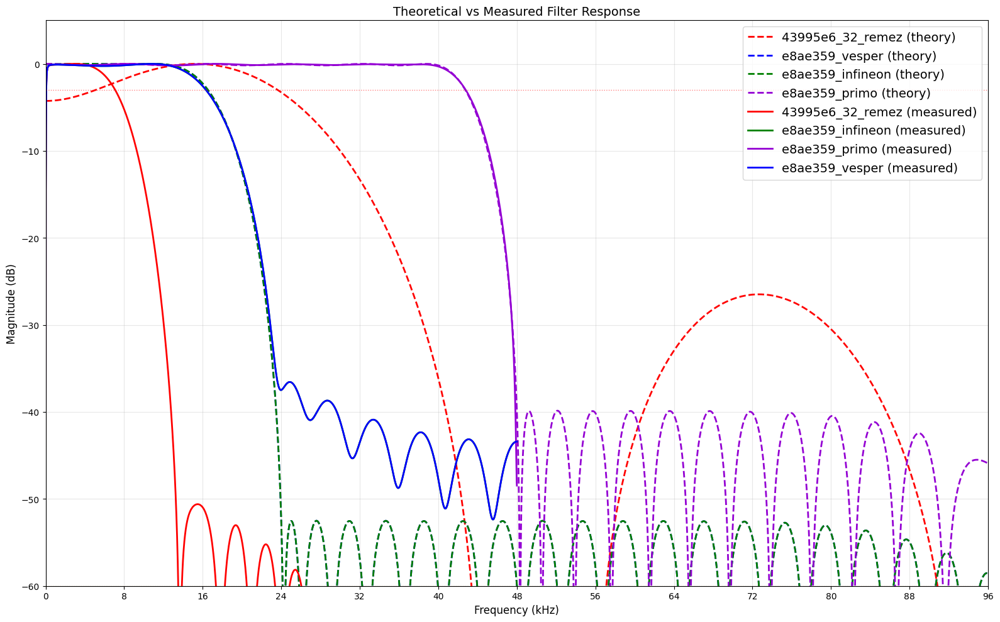

SoundThinking SST-XMOS-001 Firmware
-----------------------------------

SoundThinking XMOS firmware is built on a fork of Simon Gapp's refactoring of the XMOS reference designs, which include
the required libraries and removes unrelated hardware. We have made the following chages:

* Remove support for dynamically setting the clock as SST-XMOS-001 hw has fixed 24.576 MHz clock.
* Increase the output sampling rate from 48 kHz to 96 kHz.
* Use one decimator instance (see `decimate_to_pcm4ch.S`) for every two mics instead of one for every four. This removes a computatal performance limitation with that prevented the use of longer FIR filters. Note this reduces the total mic capacity of the board to 8 channels.
* The four buttons/switches on the reference schematic have been repurposed as board revision fuses, allowing 16 board variants. Three variants are currently defined:

| Fuse | Microphone        | Sensitivity | AOP        | Resonance | Pass freq | Stop freq | filter attenuation (DC)    | digital gain |
|------|-------------------|-------------|------------|-----------|-----------|-----------|----------------------------|--------------|
|  0xF | Vesper VM3000     | -26 dBFS    | 122 dB SPL | ~12.5 kHz |  10.0 kHz | 20.0 kHz  | 0.604 * 0.679 = -7.74 dB |  1  |
|  0xE | Infineon IM72D128 | -36 dBFS    | 130 dB SPL | ~37.0 kHz |  12.0 kHz | 24.0 kHz  | 0.604 * 0.664 = -7.93 dB |  3  |
|  0xC | Primo EM215       | -67 dBFS    | 150 dB SPL | > 40 kHz  |  44.0 kHz | 52.0 kHz  | 0.604 * 0.559 = -9.43 dB |  1  |

Sensitivity is relative to 1 kHz 94 dB SPL unless otherwise noted.

* Primo EM215 gain is purposely set low so that 0 dBFS = 148 dB SPL, vs 0 dBFS = 124 dBFS for public safety.

The Vesper board is gain 1 because we previously designed our filters to match the output of other ShotSpotter
sensors, namely that 94 dB SPL = 0 dB FS = 1.0 float. Gain of the IM72D128 is 10^((-36 - -26)/20) = 3.16. The
EM215 has additional analog hardware (an ADC) so there is not a straightforward computation. In [SCPT-510] we
compared chirp data and found Vespers to by 24 dB lower sensitivity than VM3000, hence the gain value of
10^(24/20) = 15.84.

### Filter implementation.

The first stage is substantially identical to XMOS reference implementation. The second and third stages are a complete rewrite. We implement the second and third stages as a cascade: 2:1 decimation in second stage followed by 2:1 decimation in the third stage. See `decimate_to_pcm_cascade.S`. (The prior (non-cascade) code is present in decimate_to_pcm.S. We continue to maintain it, but it is not linked in the final binary.)

#### First stage:
PDM to PCM converter, low-pass anti-aliasing filter and 4:1 decimator, implemented with lookup tables.
* Input: 3072 kHz
* Output: 384 kHz
* Taps: 48 (fixed)

#### Second stage
This is a Type I filter. Filter is implemented double-word load (`ldd`) instructions that walk over all 48 coefficients (47 taps plus a pad zero).
* low-pass anti-aliasing filter and 2:1 decimation
* Input: 384 kHz
* Output: 192 kHz
* Taps: 47 (48 coefficients with pad word)

#### Third stage
This is a Type I (odd) filter. This filter is also implemented double-word load (`ldd`) instructions that walk over all 48 coefficients (47 taps plus a pad zero). I am using a half-band filter for the EM215, but since the same code is code for all microphones, no optimizaitons are made.
* low-pass anti-aliasing filter and 2:1 decimation
* Input: 192 kHz
* Output: 96 kHz
* Taps: 47 (48 coefficients with pad word)


To regenerate filters, run `fir_design_cascade.py`, which will update `fir_coefs_cascade.xc`. If filter cutoffs frequencies changed, update filter names in `decimate_to_pcm_cascade.S`.

The main filtering loop is requires high performance. It makes heavy use of the XMOS architecture `ldd`
command, which does a single-cycle double-word load based on an immediate offset to an address in a register.
The immediate offset must be in range 0..11, so `ldd` can support loading up to 24 words following the
register address. The current code `ldd`s and `maccs` 24 coefficients, then shifts the register and does the
other 24 coefficients. (We have odd number of coefficients because Type I filters
have better properties overall; the last) word is a zero pad.) The necessary circular buffer is implemented
by writing every input data point twice and then walking backards through the left-hand side of the array.

Actual layout in memory looks like this (simplified 8 tap version):

```
H G F E D C B A H G F E D C B A h g f e d c b a h g f e d c b a
```

where upper case letters are used for channel 0 and lower case letters for channel 1. The FIR starts
at the midpoint - 2 and moves backwards:

| call       | data              |
|------------|-------------------|
| First call | `B A H G F E D C` |
| Second call| `D C B A H G F E` |
| Third call | `F E D C B A H G` |

etc., eventually wrapping back to the first call position. Because of the heavy use of `ldd` instructions
with immediate mode:
```
lddi d, e, b, i
d <- mem[b+i×Bpw×2]
e <- mem[b+i×Bpw×2+Bpw]
```
what would normally be implemented with a double-loop is implemented as 24 near-copies of a 4-block sequence inside `while (1){}` loop `fir_loop_type1`:

* block 1: read data from 1st stage; apply stage 3 filter (2:1 decimate)
* block 2: read data from 1st stage; apply stage 2 filter (2:1 decimate)
* block 3: read data from 1st stage; output stage 3 data to caller
* block 4: read data from 1st stage; apply stage 2 filter (2:1 decimate)

Admittedly, it looks pretty horrible, but doing it this way is both fast requires only a small number of registers. The code is programmatically-generated; see `generate_filter_loop.py`.

## Extension to 192 kHz
There is probably sufficient MIPS remaining to output at 192 kHz. The main challenge is that third stage could not longer use `ldd`, since `ldd` requires double-word load and the third stage would no longer implement a 2:1 decimation. The word-equivalent instruction `ldw` also only accepts (0.11) immediates, so the third stage filter would either need to drop to 24 taps or switch to a different (and less performant) approach, such as using `ldw dp[u16]` for data and `ldw cp[u16]` for the coefficients.

### Filter delay computation

STAGE 1: PDM Decimation Filter
*  Taps: 48
*  Filter type: Symmetric Type II FIR (linear phase)
*  Group delay (samples): 23.5
*  Group delay (time): 0.008 ms
*  After decimation ÷8: equivalent to 0.061 ms at 384 kHz

STAGE 2: Half-band Anti-Aliasing Filter (48-96 kHz)
*  Taps: 47/48
*  Filter type: Symmetric Type I FIR (linear phase)
*  Group delay (samples): (N−1)/2 samples @ 384 kHz
*  Group delay (time): 0.0612 ms

STAGE 3: Arbitrary filter - OPTIONAL
*  Taps: 47/48
*  Filter type: Symmetric Type I FIR (linear phase)
*  Group delay (samples): (N−1)/2 samples @ 192 kHz
*  Group delay (time): 0.1224 ms

### Overall delay

| Stage  |      delay |
|--------|------------|
| Stage 1| 0.008 msec |
| Stage 2| 0.0612 msec|
| Stage 3| 0.1224 msec|
| Total  | 0.1916 msec|

Applications where absolute timestamp is important should compensate for the filter delay.


### Code Flow

See `main.xc` function `main()` calls for code entry point.

In XC, parallel threads are launched with a `par{}` block. Communication between
tiles or between parallel threads is done with channels.

Tile 0 reads the board fuses and digitizes the audio.

Tile 1 runs endpoint0 and handles all USB audio functions.

Rebuilding:

```
#  start xmos shell. You must be in the XTC directory to source `SetEnv`.

cd ~/XMOS/XTC/15.3.1/
. SetEnv
cd ~/xmos_usb_mems_interface/01Firmware/PDM_USB/PDM_USB
xmake clean
xmake
```

Rebuiding with console:

Uncomment the DEBUG flag in the Makefile, rebuild, run with `xrun --io`.
```
xmake clean
xmake
xrun --io  bin/SST-XMOS-001_v2.8.0.xe
```

Debugger:

```
xmake clean
xmake
xgdb bin/SST-XMOS-001_v2.8.0.xe
connect
run
```

I never got xscope to work.

### Flashing the factory image

This is done on a host machine that has XMOS Tools installed.

Our "factory image" is version 2.8.0. This can be inspected on the sensor with lsusb or the xmos-dfu tool.

```
xflash --factory bin/SST-XMOS-001_v2.8.0.xe
```

Upgrade images:

* versions with even final digits are xflash versions
* versions with odd final digits are the dfu-version of the previous xflash version

Example:
* 2.9.0 : xflash version (factory)
* 2.9.1 : dfu version for xmosdfu.

These will be installed from the sensor's dfu tool, but we need to format the firmware image using xflash on the build host.

* make any needed coded changes
* update 01Firmware/PDM_USB/PDM_USB/src/core/customdefines.h
* update filename in Makefile
* check it in
* xmake clean && xmake
* commit the factory version
* bump 01Firmware/PDM_USB/PDM_USB/src/core/customdefines.h by 0.0.1
* update filename in Makefile
* xmake clean && xmake
* make it into a firmware image using xflash
* revert customdefines.h and Makefile so we're ready for the next code change.

We use "upgrade 1" to be the last digit of our version.

Factory image => 2.8.0
Upgrade 1     => 2.8.1


```
xflash --factory-version 15.2 --upgrade 1 bin/SST-XMOS-001_v2.8.1.xe -o SST-XMOS-001_v2.8.1.xflash_15.2.bin
```

```
xflash --factory-version 15.3 --upgrade 1 bin/SST-XMOS-001_v2.9.1.xe -o SST-XMOS-001_v2.9.1.xflash_15.3.bin
xflash --factory-version 14.4 --upgrade 1 bin/SST-XMOS-001_v2.9.1.xe -o SST-XMOS-001_v2.9.1.xflash_14.4.bin
#
xflash --factory-version 15.3 --upgrade 6 bin/SST-XMOS-001_v3.0.1.xe -o SST-XMOS-001_v3.0.1.xflash_15.3.bin
xflash --factory-version 14.4 --upgrade 6 bin/SST-XMOS-001_v3.0.1.xe -o SST-XMOS-001_v3.0.1.xflash_14.4.bin
#
xflash --factory-version 15.3 --upgrade 7 bin/SST-XMOS-001_v3.0.3.xe -o SST-XMOS-001_v3.0.3.xflash_15.3.bin
xflash --factory-version 14.4 --upgrade 7 bin/SST-XMOS-001_v3.0.3.xe -o SST-XMOS-001_v3.0.3.xflash_14.4.bin
#
xflash --factory-version 15.3 --upgrade 8 bin/SST-XMOS-001_v3.0.7.xe -o SST-XMOS-001_v3.0.7.xflash_15.3.bin
xflash --factory-version 14.4 --upgrade 8 bin/SST-XMOS-001_v3.0.7.xe -o SST-XMOS-001_v3.0.7.xflash_14.4.bin
#
xflash --factory-version 15.3 --upgrade 9 bin/SST-XMOS-001_v3.0.9.xe -o SST-XMOS-001_v3.0.9.xflash_15.3.bin
xflash --factory-version 14.4 --upgrade 9 bin/SST-XMOS-001_v3.0.9.xe -o SST-XMOS-001_v3.0.9.xflash_14.4.bin
# Note this is not a legal USB BCD version
xflash --factory-version 15.3 --upgrade 10 bin/SST-XMOS-001_v3.0.11.xe -o SST-XMOS-001_v3.0.11.xflash_15.3.bin
xflash --factory-version 14.4 --upgrade 10 bin/SST-XMOS-001_v3.0.11.xe -o SST-XMOS-001_v3.0.11.xflash_14.4.bin
# 3.0.12/3.0.13: lower pass band. Note this is not a legal USB BCD version
xflash --factory-version 15.3 --upgrade 10 bin/SST-XMOS-001_v3.0.13.xe -o SST-XMOS-001_v3.0.13.xflash_15.3.bin
xflash --factory-version 14.4 --upgrade 10 bin/SST-XMOS-001_v3.0.13.xe -o SST-XMOS-001_v3.0.13.xflash_14.4.bin
# 3.1.0/3.1.1: same as above, but legal USB BCD version
xflash --factory-version 15.3 --upgrade 11 bin/SST-XMOS-001_v3.1.1.xe -o SST-XMOS-001_v3.1.1.xflash_15.3.bin
xflash --factory-version 14.4 --upgrade 11 bin/SST-XMOS-001_v3.1.1.xe -o SST-XMOS-001_v3.1.1.xflash_14.4.bin
sha256sum SST-XMOS-001_v3.1.1.xflash_14.4.bin > SST-XMOS-001_v3.1.1.xflash_14.4.bin.hash
sha256sum SST-XMOS-001_v3.1.1.xflash_15.3.bin > SST-XMOS-001_v3.1.1.xflash_15.3.bin.hash
rm *.ppb
# 3.1.2/3.1.3: increase third-stage passband frequency and gain
xflash --factory-version 15.3 --upgrade 12 bin/SST-XMOS-001_v3.1.3.xe -o SST-XMOS-001_v3.1.3.xflash_15.3.bin
xflash --factory-version 14.4 --upgrade 12 bin/SST-XMOS-001_v3.1.3.xe -o SST-XMOS-001_v3.1.3.xflash_14.4.bin
sha256sum SST-XMOS-001_v3.1.3.xflash_14.4.bin > SST-XMOS-001_v3.1.3.xflash_14.4.bin.hash
sha256sum SST-XMOS-001_v3.1.3.xflash_15.3.bin > SST-XMOS-001_v3.1.3.xflash_15.3.bin.hash
rm *.ppb

# 3.1.4/3.1.5: hack around defective fuses, OS-6357. changes NOT commmited, burn these version #s.
xflash --factory-version 15.3 --upgrade 13 bin/SST-XMOS-001_v3.1.5.xe -o SST-XMOS-001_v3.1.5.xflash_15.3.bin
xflash --factory-version 14.4 --upgrade 13 bin/SST-XMOS-001_v3.1.5.xe -o SST-XMOS-001_v3.1.5.xflash_14.4.bin
sha256sum SST-XMOS-001_v3.1.5.xflash_14.4.bin > SST-XMOS-001_v3.1.5.xflash_14.4.bin.hash
sha256sum SST-XMOS-001_v3.1.5.xflash_15.3.bin > SST-XMOS-001_v3.1.5.xflash_15.3.bin.hash
rm *.ppb

# 3.1.6/3.1.7: fix DC offset issues (unfielded)
xflash --factory-version 15.3 --upgrade 13 bin/SST-XMOS-001_v3.1.7.xe -o SST-XMOS-001_v3.1.7.xflash_15.3.bin
xflash --factory-version 14.4 --upgrade 13 bin/SST-XMOS-001_v3.1.7.xe -o SST-XMOS-001_v3.1.7.xflash_14.4.bin
sha256sum SST-XMOS-001_v3.1.7.xflash_14.4.bin > SST-XMOS-001_v3.1.7.xflash_14.4.bin.hash
sha256sum SST-XMOS-001_v3.1.7.xflash_15.3.bin > SST-XMOS-001_v3.1.7.xflash_15.3.bin.hash
rm *.ppb

# 3.1.8/3.1.9: field DC offset issue and tweak digital gain by ~2.3 dB
xflash --factory-version 15.3 --upgrade 13 bin/SST-XMOS-001_v3.1.9.xe -o SST-XMOS-001_v3.1.9.xflash_15.3.bin
xflash --factory-version 14.4 --upgrade 13 bin/SST-XMOS-001_v3.1.9.xe -o SST-XMOS-001_v3.1.9.xflash_14.4.bin
sha256sum SST-XMOS-001_v3.1.9.xflash_14.4.bin > SST-XMOS-001_v3.1.9.xflash_14.4.bin.hash
sha256sum SST-XMOS-001_v3.1.9.xflash_15.3.bin > SST-XMOS-001_v3.1.9.xflash_15.3.bin.hash
rm *.ppb

```


IMPORTANT: The binary must be built with `--factory-version` set to match the version of XMOS XTC
that used to run `xflash`, not the version that was used to compile the `.xe` file. There is no
obvious way to identify what version of `xflash` was used. We found it necessary to package binaries
both XTC 14 and XTC 15 versions of xflash. If the binary can be DFU updated successfully (as determined
by `lsusb` bcd version), then it was the right format. I know of no easier way.

Build both variants (XTC 14 and XTC 15) and add them to the root file system via buildroot.

```
SCP-00-CEX-3804 (eMMC:2p2):/lib/firmware/xmos $ ls
SST-XMOS-001_v2.6.1.xflash_14.4.bin
SST-XMOS-001_v2.6.1.xflash_14.4.bin.hash
SST-XMOS-001_v2.6.1.xflash_15.2.bin
SST-XMOS-001_v2.6.1.xflash_15.2.bin.hash
```

Then on the sensor, check version using xmosdfu. Our devices is VID 0x20b1, PID 0x8.

The version is "0x280", which is "2.8.0".

```
$ xmosdfu --listdevices
VID = 0x1bc7, PID = 0x1201, BCDDevice: 0x318
VID = 0x1d6b, PID = 0x2, BCDDevice: 0x515
VID = 0x20b1, PID = 0x8, BCDDevice: 0x280
VID = 0x1d6b, PID = 0x2, BCDDevice: 0x515
```

 install the upgrade using:
```
$ xmosdfu SST_XMOS_001_V1 --download SST-XMOS-001_v2.8.1.bin

XMOS DFU application started - Interface 2 claimed
Detaching device from application mode.
Waiting for device to restart and enter DFU mode...
DFU device plugged on bus 1, dev 3
... DFU firmware upgrade device opened
... Downloading image (SST-XMOS-001_v2.8.1.bin) to device
... Download complete
... Returning device to application mode

Application (eMMC:2p5):~ $ xmosdfu --listdevices
VID = 0x1bc7, PID = 0x1201, BCDDevice: 0x318
VID = 0x1d6b, PID = 0x2, BCDDevice: 0x515
VID = 0x20b1, PID = 0x8, BCDDevice: 0x281
VID = 0x1d6b, PID = 0x2, BCDDevice: 0x515
```

You can upgrade without stopping the user application. It will throw an audio error and recover after the xmos board reboots.
```
Nov  2 20:33:21 kern.err kernel: [  929.818710] usb 1-1: 1:0: usb_set_interface failed (-71)
Nov  2 20:33:21 kern.info kernel: [  930.182461] usb 1-1: USB disconnect, device number 2
Nov  2 20:33:21 kern.info kernel: [  930.461687] usb 1-1: new high-speed USB device number 3 using ci_hdrc
Nov  2 20:33:21 kern.info kernel: [  930.622566] usb 1-1: New USB device found, idVendor=20b1, idProduct=0008, bcdDevice= 1.00
Nov  2 20:33:21 kern.info kernel: [  930.630796] usb 1-1: New USB device strings: Mfr=1, Product=3, SerialNumber=0
Nov  2 20:33:21 kern.info kernel: [  930.638067] usb 1-1: Product: SST-XMOS-001 UAC2.0
Nov  2 20:33:21 kern.info kernel: [  930.642819] usb 1-1: Manufacturer: SST
Nov  2 20:33:22 Application user.notice watcher: Application failed a status check:1
Nov  2 20:33:27 kern.info kernel: [  936.196003] usb 1-1: USB disconnect, device number 3
Nov  2 20:33:27 kern.info kernel: [  936.469817] usb 1-1: new high-speed USB device number 4 using ci_hdrc
Nov  2 20:33:27 kern.info kernel: [  936.630686] usb 1-1: New USB device found, idVendor=20b1, idProduct=0008, bcdDevice= 2.81
Nov  2 20:33:27 kern.info kernel: [  936.638897] usb 1-1: New USB device strings: Mfr=1, Product=3, SerialNumber=0
Nov  2 20:33:27 kern.info kernel: [  936.646157] usb 1-1: Product: SST-XMOS-001 UAC2.0
Nov  2 20:33:27 kern.info kernel: [  936.650906] usb 1-1: Manufacturer: SST
Nov  2 20:34:15 kern.debug Application: Starting
Nov  2 20:34:15 kern.debug Application: usbArray: 'xCORE-200'
```

Analyzing Results
=================
When `OUTPUT_RANDOM` defined in `pdm_rx.S`, uniform random noise is injected into channel 7. This is a good way to verify that the filter and gain settings for each board are as desired.

Red plot shows the old code with the defective DC baseline restore, and the new code. Vesper and Infineon use the same filter, so they appear on top of each other.

BoardRev = 0xF (Vesper VM3000)
----------------



Debugging and Processor Headroom Measurement
============================================

1) build the application:
```
xmake -clean && xmake
```
2) run using gdb:
```
xgdb bin/SST-XMOS-001_v2.9.2.xe
```
3) Bootstrap gdb:
```
continue
run
```
4) Let it run long enough to initialize everything. Break with ^C and inspect threads:
```
Thread 2.1 received signal SIGINT, Interrupt.
[Switching to tile[1] core[0]]
deliver (divide=0, curSamFreq=0, c_out=<optimized out>, c_spd_out=<optimized out>, c_pdm_pcm=<optimized out>, c_adc=<optimized out>) at ../src/audio.xc:89
89                              c_pdm_pcm <: 1;
(gdb) info threads
  Id   Target Id            Frame
  1.1  tile[0] core[0] (hw) mic_array_get_next_time_domain_frame (c_from_decimator=..., buffer=@0x7fe84: 2, dc=..., audio=<optimized out>)
    at /home/rcalhoun/xmos_usb_mems_interface/01Firmware/PDM_USB/lib_mic_array/src/decimator_interface.xc:103
  1.2  tile[0] core[1] (hw) 0x0004122c in XMOS_DFU_RevertFactory (c_user_cmd=<optimized out>)
    at /home/rcalhoun/xmos_usb_mems_interface/01Firmware/PDM_USB/module_dfu/src/dfu.xc:309
  1.3  tile[0] core[2] (hw) 0x00044452 in ?? ()
  1.4  tile[0] core[3] (hw) mic_array_decimate_to_pcm_2ch ()
    at /home/rcalhoun/xmos_usb_mems_interface/01Firmware/PDM_USB/lib_mic_array/src/decimate_to_pcm_4ch.S:520
  1.5  tile[0] core[4] (hw) mic_array_decimate_to_pcm_2ch ()
    at /home/rcalhoun/xmos_usb_mems_interface/01Firmware/PDM_USB/lib_mic_array/src/decimate_to_pcm_4ch.S:518
  1.6  tile[0] core[5] (hw) mic_array_decimate_to_pcm_2ch ()
    at /home/rcalhoun/xmos_usb_mems_interface/01Firmware/PDM_USB/lib_mic_array/src/decimate_to_pcm_4ch.S:520
  1.7  tile[0] core[6] (hw) mic_array_decimate_to_pcm_2ch ()
    at /home/rcalhoun/xmos_usb_mems_interface/01Firmware/PDM_USB/lib_mic_array/src/decimate_to_pcm_4ch.S:518
  1.8  tile[0] core[7] (hw) pdm_rx_asm () at /home/rcalhoun/xmos_usb_mems_interface/01Firmware/PDM_USB/lib_mic_array/src/pdm_rx.S:171
* 2.1  tile[1] core[0] (hw) deliver (divide=0, curSamFreq=0, c_out=<optimized out>, c_spd_out=<optimized out>, c_pdm_pcm=<optimized out>, c_adc=<optimized out>)
    at ../src/audio.xc:89
  2.2  tile[1] core[1] (hw) 0x00041c58 in decouple (c_mix_out=2147681026) at ../src/usb_buffer/decouple.xc:461
  2.3  tile[1] core[2] (hw) buffer (c_aud_out=<optimized out>, c_aud_in=2147683330, c_sof=2147681794, c_aud_ctl=2147684098, p_off_mclk=<optimized out>)
    at ../src/usb_buffer/usb_buffer.xc:275
  2.4  tile[1] core[3] (hw) XUD_GetSetupData () at /home/rcalhoun/xmos_usb_mems_interface/01Firmware/PDM_USB/module_xud/src/XUD_EpFuncs.S:41
  2.5  tile[1] core[4] (hw) 0x00045176 in XUD_TokenRx_Pid ()
```
5) Switch one of the (four) `mic_array_decimate_to_pcm_2ch ()` threads.
```
thread 1.4
```
Read the value at `S_DEBUG_MAX_CYCLES_OFFSET`. In the current code this is at word 154 above the stack pointer or address sp + 154 * 4 = sp + 616. You can extract the defines and expose them to xgdb with something like this:
```
# Re-compute stack layout like the preprocess. You'll need to update this if you 
# change the stack layout.

# Define main constants (in words)
set $S_SECOND_STAGE_SIZE = 8
set $SECOND_STAGE_TAPS = 32

# Recreate the math from decimate_to_pcm_4ch.S configuration
set $SECOND_STAGE_HISTORY_SIZE = (($SECOND_STAGE_TAPS + 3) / 4) * 4
set $THIRD_STAGE_COEF_COUNT = 32

# Calculate Stack Structure Sizes (in words)
set $S_STORAGE_SIZE = 12
set $DC_ELIMINATE_STACK_SIZE = 12
set $S_SECOND_STAGE_DATA_SIZE = $SECOND_STAGE_HISTORY_SIZE * 2 * 2
set $S_THIRD_STAGE_DATA_SIZE = $THIRD_STAGE_COEF_COUNT * 2 * 2
set $S_THIRD_STAGE_SIZE = 8

# Calculate Offsets (in words)
# S_SECOND_STAGE = S_STORAGE + S_DC_ELIMINATE + S_SECOND_STAGE_DATA
set $OFFSET_S_SECOND_STAGE = $S_STORAGE_SIZE + $DC_ELIMINATE_STACK_SIZE + $S_SECOND_STAGE_DATA_SIZE

# The specific variable you want (Offset 2 inside S_SECOND_STAGE)
set $S_DEBUG_MAX_CYCLES_OFFSET = $OFFSET_S_SECOND_STAGE + 2

# Define a helper command for your documentation
define log_cycles
    # Convert word offset to byte offset (*4)
    print *(unsigned*)($sp + ($S_DEBUG_MAX_CYCLES_OFFSET * 4))
end
```
then load it as a script in gdb:

```
(gdb) thread 1.4
[Switching to thread 1.4 (tile[0] core[3])]
#0  post_process ()
    at /home/rcalhoun/xmos_usb_mems_interface/01Firmware/PDM_USB/lib_mic_array/src/decimate_to_pcm_4ch.S:698
698         {in r3, res[r6]; ldc r0, 0}
(gdb) source debug_offsets.gdb 
(gdb) log_cycles
$1 = 164
```

The "Max Cycle Count" tracker updates a variable on the stack (sp[S_DEBUG_MAX_CYCLES]) whenever a new maximum is observed for the critical processing block (4 samples).

Location: The code measures the block containing third_stage, post_process, and divide_by_four (lines ~840 in the original file).

* Measurement: Uses the gettime instruction (100 MHz reference clock).
* Storage: The max value is stored at stack offset `sp[S_DEBUG_MAX_CYCLES]`

How to Monitor
--------------
* Build and Run your code with the xTag attached.
* Pause the execution after it has run for a few seconds.
* Inspect Memory relative to the Stack Pointer (sp).
* Print the value located at `sp[S_DEBUG_MAX_CYCLES]`:

```
print *(unsigned*)($sp + ($S_DEBUG_MAX_CYCLES_OFFSET * 4))
```

Breaking the code breaks the real-time acquisition, so after reading the result just exit gdb.

"Target Limit: At 384 kHz, you have ~260 cycles per sample (4-sample block period = 1040 cycles).
Estimated Usage: My static analysis predicts ~550 cycles for a 4-sample block.
If you see values approaching 1000 cycles, you are close to the limit."

So the value of 164 is very good.

Useful `xgdb` commands:
=======================
* show running threads: `info threads`
* switch to thread: `thread <thread-number>`
* change tile: `tile 0`
* show registers: `info registers`
* break at an address (current tile): `break *0x000420c0`
* examine memory around address loaded in `r7`: `x/16xw $r7`
* step: `stepi`
* disassemble some code around `pc`: `disassemble $pc-32, $pc+32`
