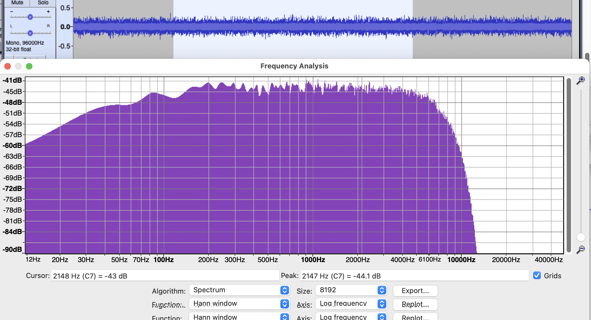
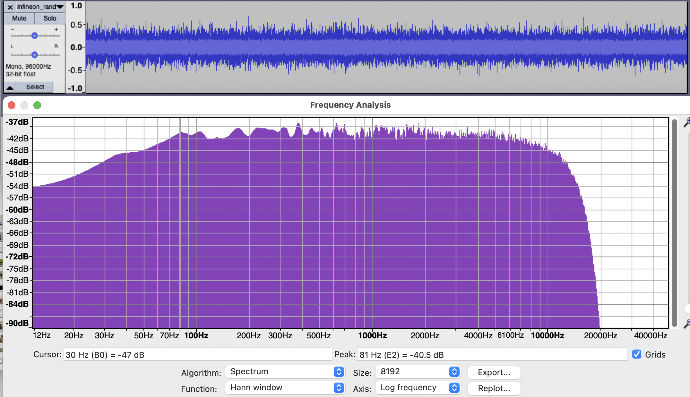

SoundThinking SST-XMOS-001 Firmware
-----------------------------------

SoundThinking XMOS firmware is built on a fork of Simon Gapp's refactoring of the XMOS reference designs, which include
the required libraries and removes unrelated hardware. We have made the following chages:

* Remove support for dynamically setting the clock as SST-XMOS-001 hw has fixed 24.576 MHz clock.
* Increase the output sampling rate from 48 kHz to 96 kHz.
* Use one decimator instance (see `decimate_to_pcm4ch.S`) for every two mics instead of one for every four to remove
  a computation performance limitation with that prevented the use of longer FIR filters. Note this reduces
  the total mic capacity of the board to 8 channels.
* The four buttons/switches on the reference schematic have been repurposed as board revision fuses, allowing 16
  board variants. Three variants are currently defined:

| Fuse | Microphone        | Sensitivity | AOP        | Cutoff freq | gain |
|------|-------------------|--------------------------|-------------|------|
|  0xF | Vesper VM3000     | -26 dBFS    | 122 dB SPL | 8 kHz       | 1    |
|  0xE | Infineon IM72D128 | -36 dBFS    | 130 dB SPL | 16 kHz      | 3    |
|  0xD | Primo EM215       | -67 dBFS    | 150 dB SPL | 32 kHz      | 16   |

Sensitivity is relative to 1 kHz 94 dB SPL unless otherwise noted.

The Vesper board is gain 1 because we previously designed our filters to match the output of other ShotSpotter
sensors, namely that 94 dB SPL = 0 dB FS = 1.0 float. Gain of the IM72D128 is 10^((-36 - -26)/20) = 3.16. The
EM215 has additional analog hardware (an ADC) so there is not a straightforward computation. In [SCPT-510] we
compared chirp data and found Vespers to by 24 dB lower sensitivity than VM3000, hence the gain value of
10^(24/20) = 15.84.

First stage: PDM to PCM converter and decimator
Input: 3072 kHz
Output: 384 kHz
Taps: 48 (fixed)

Second stage:
Input: 384 kHz
Output: 96 kHz
Tags: 16

Third stage:
Input: 96 kHz
Output: 96 kHz
Taps: 32


Flow
----
See `main.xc` function `main()` calls for code entry point.

In XC, parallel threads are launched with a `par{}` block. Communication between
tiles or between parallel threads is done with channels.

Tile 0 reads the board fuses and digitizes the audio.

Tile 1 runs endpoint0 and handles all USB audio functions.

Rebuilding:

```
#  start xmos shell. You must be in the XTC directory to source `SetEnv`.

cd /XMOS/XTC/15.3.1/
. SetEnv
cd xmos_usb_mems_interface/01Firmware/PDM_USB/PDM_USB
xmake clean
xmake
```

Rebuiding with console:

Uncomment the DEBUG flag in the Makefile, rebuild, run with `xrun --io`.
```
xmake clean
xmake
xrun --io  bin/SST-XMOS-001_v2.8.0.xe
```

Factory image:

This is done on a host machine that has XMOS Tools installed.

Our "factory image" is version 2.8.0. This can be inspected on the sensor with lsusb or the xmos-dfu tool.

```
xflash --factory bin/SST-XMOS-001_v2.8.0.xe
```

Upgrade images:

These will be installed from the sensor's dfu tool, but we need to format the firmware image using xflash on the build host.

* make any needed coded changes
* update 01Firmware/PDM_USB/PDM_USB/src/core/customdefines.h
* check it in
* xmake clean && xmake
* make it into a firmware image using xflash

We use "upgrade 1" to be the last digit of our version.

Factory image => 2.8.0
Upgrade 1     => 2.8.1

```
xflash --factory-version 15.2 --upgrade 1 bin/SST-XMOS-001_v2.8.1.xe -o SST-XMOS-001_v2.8.1.xflash_15.2.bin
```

IMPORTANT: The binary must be built with `--factory-version` set to match the version of XMOS XTC
that used to run `xflash`, not the version that was used to compile the `.xe` file. There is no
obvious way to identify what version of `xflash` was used. We found it necessary to package binaries
both XTC 14 and XTC 15 versions of xflash. If the binary can be DFU updated successfully (as determined
by `lsusb` bcd version), then it was the right format. I know of no easier way.

Build both variants (XTC 14 and XTC 15) and add them to the root file system via buildroot.

```
SCP-00-CEX-3804 (eMMC:2p2):/lib/firmware/xmos $ ls
SST-XMOS-001_v2.6.1.xflash_14.4.bin
SST-XMOS-001_v2.6.1.xflash_14.4.bin.hash
SST-XMOS-001_v2.6.1.xflash_15.2.bin
SST-XMOS-001_v2.6.1.xflash_15.2.bin.hash
```

Then on the sensor, check version using xmosdfu. Our devices is VID 0x20b1, PID 0x8.

The version is "0x280", which is "2.8.0".

```
$ xmosdfu --listdevices
VID = 0x1bc7, PID = 0x1201, BCDDevice: 0x318
VID = 0x1d6b, PID = 0x2, BCDDevice: 0x515
VID = 0x20b1, PID = 0x8, BCDDevice: 0x280
VID = 0x1d6b, PID = 0x2, BCDDevice: 0x515
```

 install the upgrade using:
```
$ xmosdfu SST_XMOS_001_V1 --download SST-XMOS-001_v2.8.1.bin

XMOS DFU application started - Interface 2 claimed
Detaching device from application mode.
Waiting for device to restart and enter DFU mode...
DFU device plugged on bus 1, dev 3
... DFU firmware upgrade device opened
... Downloading image (SST-XMOS-001_v2.8.1.bin) to device
... Download complete
... Returning device to application mode

Application (eMMC:2p5):~ $ xmosdfu --listdevices
VID = 0x1bc7, PID = 0x1201, BCDDevice: 0x318
VID = 0x1d6b, PID = 0x2, BCDDevice: 0x515
VID = 0x20b1, PID = 0x8, BCDDevice: 0x281
VID = 0x1d6b, PID = 0x2, BCDDevice: 0x515
```

You can upgrade without stopping the user application. It will throw an audio error and recover after the xmos board reboots.
```
Nov  2 20:33:21 kern.err kernel: [  929.818710] usb 1-1: 1:0: usb_set_interface failed (-71)
Nov  2 20:33:21 kern.info kernel: [  930.182461] usb 1-1: USB disconnect, device number 2
Nov  2 20:33:21 kern.info kernel: [  930.461687] usb 1-1: new high-speed USB device number 3 using ci_hdrc
Nov  2 20:33:21 kern.info kernel: [  930.622566] usb 1-1: New USB device found, idVendor=20b1, idProduct=0008, bcdDevice= 1.00
Nov  2 20:33:21 kern.info kernel: [  930.630796] usb 1-1: New USB device strings: Mfr=1, Product=3, SerialNumber=0
Nov  2 20:33:21 kern.info kernel: [  930.638067] usb 1-1: Product: SST-XMOS-001 UAC2.0
Nov  2 20:33:21 kern.info kernel: [  930.642819] usb 1-1: Manufacturer: SST
Nov  2 20:33:22 Application user.notice watcher: Application failed a status check:1
Nov  2 20:33:27 kern.info kernel: [  936.196003] usb 1-1: USB disconnect, device number 3
Nov  2 20:33:27 kern.info kernel: [  936.469817] usb 1-1: new high-speed USB device number 4 using ci_hdrc
Nov  2 20:33:27 kern.info kernel: [  936.630686] usb 1-1: New USB device found, idVendor=20b1, idProduct=0008, bcdDevice= 2.81
Nov  2 20:33:27 kern.info kernel: [  936.638897] usb 1-1: New USB device strings: Mfr=1, Product=3, SerialNumber=0
Nov  2 20:33:27 kern.info kernel: [  936.646157] usb 1-1: Product: SST-XMOS-001 UAC2.0
Nov  2 20:33:27 kern.info kernel: [  936.650906] usb 1-1: Manufacturer: SST
Nov  2 20:34:15 kern.debug Application: Starting
Nov  2 20:34:15 kern.debug Application: usbArray: 'xCORE-200'
```

Analyzing Results
=================
When `OUTPUT_RANDOM` defined in `pdm_rx.S`, uniform random noise is injected into channel 7. This is a good way to verify that the filter and gain settings for each board are as desired.

Examples:

BoardRev = 0xF (Vesper VM3000)
----------------


BoardRev = 0xE (Infineon IM72D128)
----------------------------------

